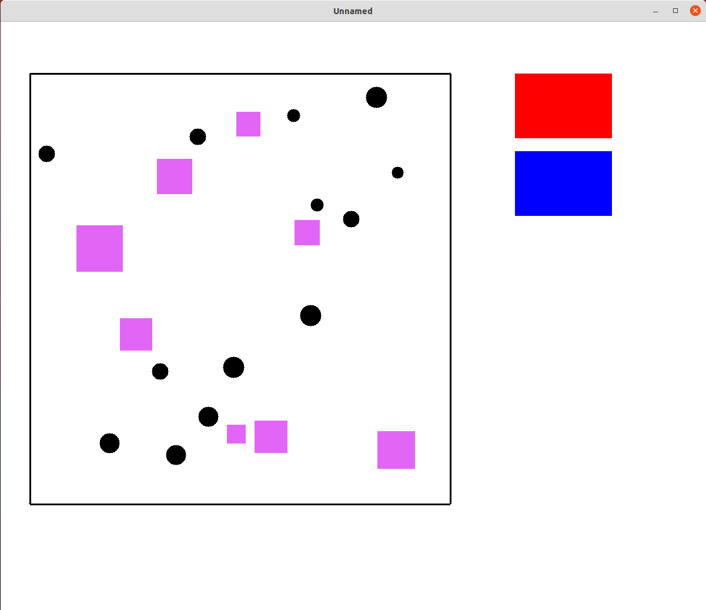

# Compiling and running
'''
make run
'''
# Description
Simulation of gas, if there's enough energy particles merge, otherwise they collide. Energy and momentum are concerved. Click red button to heat up the walls of the molecule box, click blue button to cool down